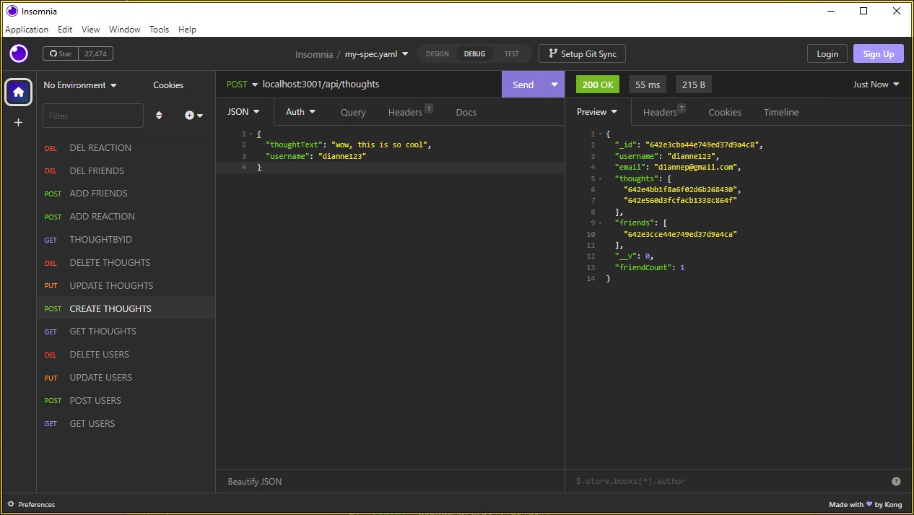

<h1 align="center">Social Media API</h1>

    
    
    
    

## Description 💾
This back-end application is a NoSQL application created using express and mongoDB. It is an API for a social network web application and will be demonstating all the different functions implemented inside of a SNS app.

In order to demonstrate we will be using an application called `Insomia`.
## User Story ✉️
~~~
AS A social media startup
I WANT an API for my social network that uses a NoSQL database
SO THAT my website can handle large amounts of unstructured data
~~~
## Acceptance Criteria 📩
~~~
GIVEN a social network API
WHEN I enter the command to invoke the application
THEN my server is started and the Mongoose models are synced to the MongoDB database
WHEN I open API GET routes in Insomnia for users and thoughts
THEN the data for each of these routes is displayed in a formatted JSON
WHEN I test API POST, PUT, and DELETE routes in Insomnia
THEN I am able to successfully create, update, and delete users and thoughts in my database
WHEN I test API POST and DELETE routes in Insomnia
THEN I am able to successfully create and delete reactions to thoughts and add and remove friends to a user’s friend list
~~~
## Table of Contents 🔍
* [Installation](#installation-)
* [Usage](#usage-)
* [Questions](#questions-)
* [License](#license)
## Installation 🔨
To install this application to your local, `git clone` this repository into your vscode.

Run `npm install` or `npm i` in order to install the following npm package,

Then start your mongoose service, and start connection on `localhost:27017`

Run `npm start` and NoSQL will automatically create database in mongoDB.

## Usage 💡

This is the mongoDB Compass that shows our database `SNS` have been created inside mongoDB.

To get started, open Insomnia once API server is running, then create a user using `POST` method on the route `localhost:3001/api/user`

The JSON format to `POST` users is
~~~
Example:
{
    "username": "anyusername"
    "email": "anyemail@email.com"
}
~~~

Thoughts can be created using the `POST` method on route `localhost:3001/api/thoughts`

The JSON format to `POST` thoughts is
~~~
Example:
{
    "thoughtText": "This is a Thought"
    "username": "anyusername"
}
~~~

All other routes can be found under the routes folder

- Find && Update && Delete Users: `localhost:3001/api/users/:userId`
- Add Friends: `localhost:3001/api/users/:userId/friends/:friendId`
- Find && Update && Delete Thoughts: `localhost:3001/api/thoughts/:thoughtId`
- Add Reactions to Thoughts: `localhost:3001/api/thoughts/:thoughtId/reactions`
- Delete Reactions: `localhost:3001/api/thoughts/:thoughtId/reactions/:reactionId`

If you would like a video walkthrough click on the like here:
<a href=https://vimeo.com/manage/videos/815235662>https://vimeo.com/manage/videos/815235662</a>

## License
MIT License

## Questions ❓

For any Additional questions, Please reach out to: jaecho203@gmail.com

Or visit slchld1 on github! Thank you.
